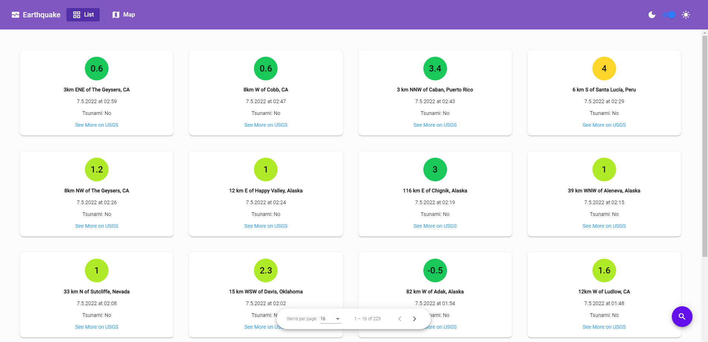
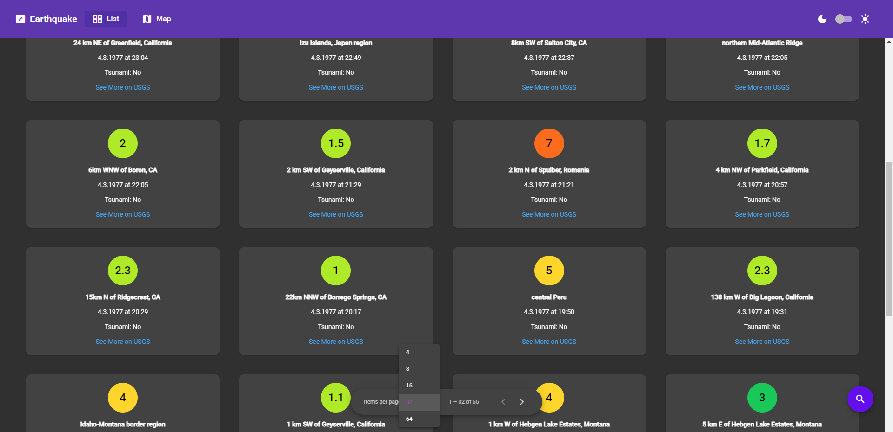
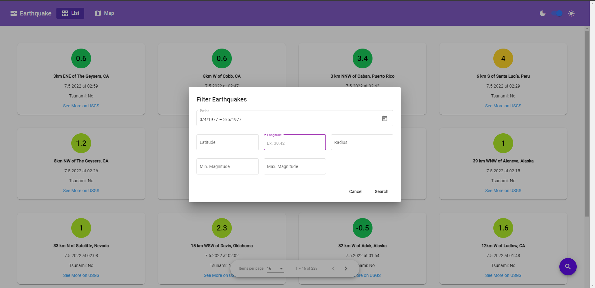
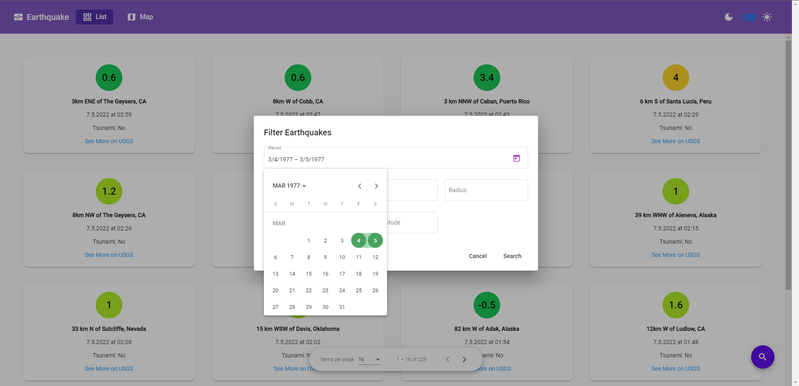
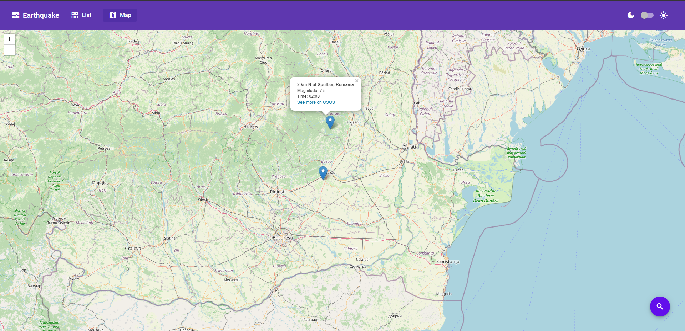

# Earthquake

Earthquake app was made using Angular and USGS.gov API.
 
For the maps i used Leaflet Map package with OpenStreet API.
 
Below there's a short presentation of the app with images.

 
 
 

List of earthquakes</b>
 

 
 
 
 
 
 

<b>Pagination and dark mode applied</b>
 

 
 
 
 
 
 

<b>Filter dialog</b>

 
 
 
 
 
 

<b>Calendar of the filter</b>

 
 
 
 
 
 

<b>Map with all earthquakes filtered</b>

